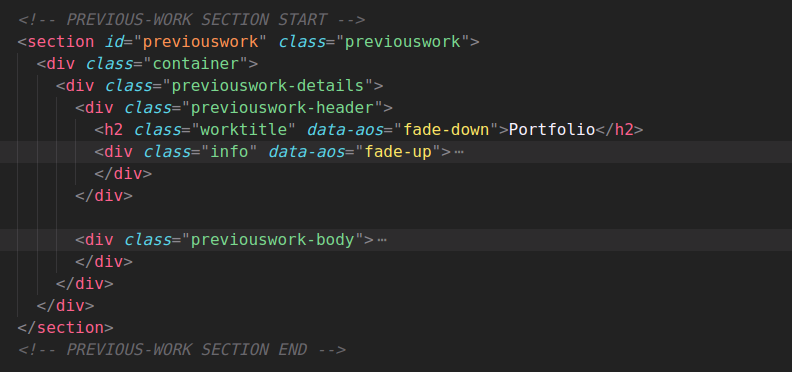

Qfolio Html Template
--------------------

Welcome to Qfolio!
==================

We are pleased that you have chosen Qfolio theme for your site and we will not disappoint you with your choice. Qfolio is an excellent theme develop with a concise approach. The code written is a clean and well structured.

Qfolio is the most powerful & responsive theme with all the modules and functions involved with an attractive design.

Qfolio theme template is build focusing on HTML and CSS3 and works perfectly fine in all the browsers and it is powered by JavaScript.

The HTML wedding template is a pre-built web design layout that you can use to create an wedding website quickly and easily. It comes with all the necessary elements and pages that are required to start home, blog-details and error. In this documentation, we will go through the features and components of this template, and how to use them to build a complete wedding website.

Read the doc before jumping to start!

### Theme Features

*   **Responsive Design   :**   Looks great on desktops, laptops, tablets and mobiles. Give it a try on your iPhone or iPad now.
*   **Made with Sass   :**   Qfolio is made with sass.
*   **W3 Validator   :**   This theme coded with beautiful and clean codes! Some powerful HTML files 100% valid W3C web standards.
*   **Element Page   :**   Qfolio have element page in which you can select elements and copy & paste the code.
*   **Page Loader   :**   Qfolio have page loader.
*   **Multi-Browser Support   :**   Qfolio has multi browser support.
*   **Fully Customizable   :**   You can fully customize.
*   **Bootstrap 5   :**   Qfolio made by boostrap latest version.
*   **Google Font   :**   You can use unlimited Google fonts.
*   **Amazing offcanvas-menu   :**   A completely different offcanvas-menu with powerfully functionality and flexible layout.

### Folder Structure

When you unpack downloaded archive you'll get folder containing 2 folders.

1.  Documentation - Documentation for Qfolio HTML site template
2.  THEME - Qfolio Main Folder

*   Theme
    *   live version
        *   all live files
    *   download version
        *   all download files
    *   assets
        *   css
            *   all css files
        *   images
            *   all images
        *   js
            *   all js files
        *   scss
            *   global
                *   \_colors.scss
                *   \_typography.scss
            *   reset
                *   \_fonts.scss
                *   \_reset.scss
            *   partials
                *   \_animation.scss
                *   \_extends.scss
                *   \_flex.scss
                *   \_mixins.scss
                *   \_media.scss
            *   components
                *   \_badges.scss
                *   \_button.scss
                *   \_card.scss
                *   \_footer.scss
                *   \_header.scss
                *   \_offcanvas.scss
                *   \_preloader.scss
                *   \_main.scss
                *   \_input.scss
                *   \_tooltip.scss
            *   pages
                *   \_home.scss
                *   \_blogdetails.scss
                *   \_error.scss
        *   style.scss

### fonts

### loader

#### How to set Page Loader

there is a loader section in starting of every front end html pages. you can remove it by just delete that section.

### Customization

#### logo

#### Menu

#### Home Banner

#### Short Bio

#### Portfolio

#### Blog

#### Contact

#### Footer

### Thank you

If you like our Templates please rate us
----------------------------------------

##### Best Regards, Qfolio
